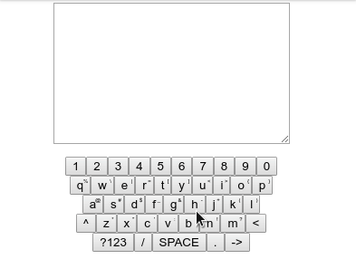

# keyboard-custom-element


> `<key-board />` element made with Custom Elements API





### Description

Fully customizable virtual keyboard. You can pass in your preferred config and styles and make it even more awesome.


### Usage

Import `key-board.js` and listen for `ck-click` event. Or just clone the repo and double click `index.html`.

You can also import script as `module` to encapsulate all the contents of it, but it needs to be served with web server like `live-server` on Chrome. It will work in Firefox.

``` HTML
<body>
  <textarea cols="30" rows="10" style="margin: 1em auto; display: block"></textarea>
  <key-board  />


  <script>
    const textarea = document.querySelector('textarea')
    const customKeyboard = document.querySelector('key-board')

    customKeyboard.addEventListener('ck-click', e => {
      switch (e.detail) {
        case 'ENTER':
          textarea.value += '\n'
          break;
        case 'BACKSPACE':
          textarea.value = textarea.value.slice(0, textarea.value.length - 1)
          break;
        case 'SPACE':
          textarea.value += ' '
          break;
        case 'ALT':
        case 'SHIFT':
          break;
        default:
          textarea.value += e.detail
          break;
      }
    })
  </script>
  <script src="./key-board.js"></script>
</body>
```
Keyboard supports regular and long click. On regular click value from `main` is returned. On long click (350ms or longer) `alt` value is returned. If your keyboard has `SHIFT` and `ALT` keys, you can toggle these values.


###### Row

Rows of keyboard are represented as arrays.
``` JS
const kbd = [
  [1, 2, 3, 4, 5, 6, 7, 8, 9, 0, '-', '='],
  ['q', 'w', 'e', 'r', 't', 'y', 'u', 'i', 'o', 'p', '[', ']'],
  ['a', 's', 'd', 'f', 'g', 'h', 'j', 'k', 'l', ';'],
  ['z', 'x', 'c', 'v', 'b', 'n', 'm'],
  ['SHIFT', 'CTRL', 'SPACE', 'ALT']
];
```
You can have as many rows and as many keys in each row as you like.

###### Key
Keys can be represented as `Number`, `String` or `Object`. If you're using objects, `main` property is mandatory and this is the most complex structure.
```JS
{
  main: 'm',
  shift: 'M',
  alt: '?'
}
```
There's also `display` property that takes precedence over `main` in what should be displayed on the key. `display` is never sent on click. It's mostly used for buttons like `BACKSPACE` where you would like something more meaningful to be displayed.
```JS
{
  display: '<',
  main: 'BACKSPACE',
}
```

### Defaults

###### CSS
``` CSS
.ck {
  position: absolute;
  left: 0;
  right: 0;
}

.ck__row {
  display: flex;
  align-items: center;
  justify-content: center;
}

.ck__key {
  position: relative
}

.ck__alt-key {
  position: absolute;
  font-size: 6px;
  right: 0.15em;
  top: 0.15em;
}
```

###### kbd
``` JS
[
  [1, 2, 3, 4, 5, 6, 7, 8, 9, 0],
  [
    {main: 'q', shift: 'Q', alt: '%'},
    {main: 'w', shift: 'W', alt: '\\'},
    {main: 'e', shift: 'E', alt: '|'},
    {main: 'r', shift: 'R', alt: '='},
    {main: 't', shift: 'T', alt: '['},
    {main: 'y', shift: 'Y', alt: ']'},
    {main: 'u', shift: 'U', alt: '<'},
    {main: 'i', shift: 'I', alt: '>'},
    {main: 'o', shift: 'O', alt: '{'},
    {main: 'p', shift: 'P', alt: '}'},
  ],
  [
    {main: 'a', shift: 'A', alt: '@'},
    {main: 's', shift: 'S', alt: '#'},
    {main: 'd', shift: 'D', alt: '$'},
    {main: 'f', shift: 'F', alt: '_'},
    {main: 'g', shift: 'G', alt: '&'},
    {main: 'h', shift: 'H', alt: '-'},
    {main: 'j', shift: 'J', alt: '+'},
    {main: 'k', shift: 'K', alt: '('},
    {main: 'l', shift: 'L', alt: ')'},
  ],
  [
    {display: '^', main: 'SHIFT'},
    {main: 'z', shift: 'Z', alt: '*'},
    {main: 'x', shift: 'X', alt: '"'},
    {main: 'c', shift: 'C', alt: '\''},
    {main: 'v', shift: 'V', alt: ':' },
    {main: 'b', shift: 'B', alt: ';'},
    {main: 'n', shift: 'N', alt: '!'},
    {main: 'm', shift: 'M', alt: '?'},
    {display: '<', main: 'BACKSPACE',},
  ],
  [
    {display: '?123', main: 'ALT'},
    '/',
    {main: 'SPACE'},
    '.',
    {display: '->', main: 'ENTER'},
  ]
];
```


### Customization

name        | description                                           | type
------------|-------------------------------------------------------|----------------------
css         | add your custom CSS to map over default one           | String
kbd         | custom keyboard configuration to map over default one | JSON.stringify(Array)
replace-kbd | should `kbd` completley replace default config        | Boolean

If you want to customize just the 6th key in third row for  example, you pass `kbd` as
``` JS
const kbd = Array(3).fill(null)
kbd[2] = Array(6)
kbd[2][5] = {display: 'en', main: 'sss'}

const customKeyboard = document.querySelector('key-board')
customKeyboard.setAttribute('kbd', JSON.stringify(kbd))
```
